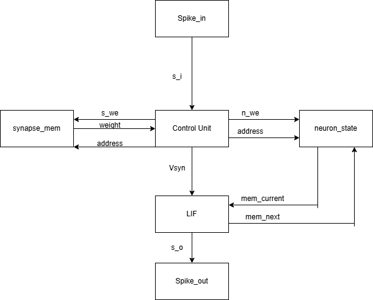

<!---

This file is used to generate your project datasheet. Please fill in the information below and delete any unused
sections.

You can also include images in this folder and reference them in the markdown. Each image must be less than
512 kb in size, and the combined size of all images must be less than 1 MB.
-->

## Spiking Pattern Detector

Spiking Pattern Detector is an application of a neuromorphic processing core, implementing a 4-neuron Spiking architecture with fixed-point precision (Q8.8). The system generates an event when the temporal spike response of an input signal matches a user-defined pattern.

The core employs a discretised Leaky Integrate-and-Fire Model with a one-to-one neuron–synapse mapping. Synaptic weights are static, and the design operates without online learning (e.g. STDP).

This architecture serves as a foundation for exploring event-driven computation systems, including:

- Real-time signal processing (event-based DSP / sparse filtering)
- Temporal pattern recognition in spike-based data streams
- **Robotic sensing and reflex systems** (low-latency event detection)

### Register Table

| Name     | Bit Width | Access | Description                                                                       |
|--------------|-----------|--------|-----------------------------------------------------------------------------------|
| Synapse_mem  | 64        | R      | Stores the values of 4 synaptic weights                                           |
| neuron_state | 64        | R/W    | Stores values of membrane potentials for 4 neurons                                |
| Spike_out    | 4         | W      | Stores a vector where the nth bit indicates whether the nth neuron spiked or not. |

### Bus Table
| Name        | Bit Width | Type    | Description                                                               |
|-------------|-----------|---------|---------------------------------------------------------------------------|
| s_i         | 1         | Input   | External spike input vector                                               |
| s_we        | 1         | Control | Synapse memory read/write select ( 0 - write, 1 - read)                   |
| n_we        | 1         | Control | Neuron state memory read/write select ( 0 - write, 1 - read)             |
| address     | 2         | Control | Address bus for synapse/neuron state memory                               |
| weight      | 16        | Data    | Bus to transmit synaptic weight data                                      |
| Vsyn        | 16        | Data    | Internal synaptic current vector                                          |
| mem_current | 16        | Data    | Membrane potential vector for current neuron in computation cycle         |
| mem_next    | 16        | Data    | Updated membrane potential vector for current neuron in computation cycle |
| s_o         | 1         | Output  | Internal spike output vector                                              |

### LIF Model

The core neuron model is based on the **Leaky Integrate-and-Fire (LIF)** formulation, a first-order approximation of neuronal membrane spiking behaviour.

In continuous time, the membrane potential evolves according to:

$$
\tau \frac{dV(t)}{dt} = -V(t) + I(t)
$$

where:
- $\tau$ is the membrane time constant (leak rate)
- $V(t)$ is the membrane potential
- $I(t)$ is the synaptic input current

When $V(t)$ exceeds a threshold $V_{th}$, the neuron emits a spike and the membrane potential is reset, similar to real biological neurons.

### Discretised Implementation

For digital hardware implementation, the model is discretised in time:

$$
V[n+1] = \alpha V[n] + I[n]
$$

where:
- $\alpha \in (0,1)$ represents the leak factor
- $V[n]$ is the membrane potential at timestep $n$
- $I[n]$ is the weighted synaptic input

In this design:
- Fixed-point arithmetic (Q8.8) is used for efficient hardware realisation
- Synaptic inputs are computed using static weights
- A spike is generated when $V[n] \geq V_{th}$
- The membrane potential is reset after firing

## How to test

1. Input a pattern to be matched using input switches. LEDs on the board will light up in correspondance with the pattern.
2. Connect the IRF520 MOSFET Driver Module's signal port to output port 5 and wire it's power ports accordingly.
3. Connect a 3-6V motor between an external 3-6V battery and the MOSFET driver module.
4. Press n_reset on the microcontroller.
5. Input a symmetric 0.5Hz square-wave signal using a signal generator into input port 5, making sure to latch your signal to high or low for your first bit before you press n_reset. 

 - A green LED will flash each time the input is being sampled
 - The current spike pattern will be indicated by a separate set of red LEDs

 6. When the current spike pattern matches the pattern input by the user, the motor should rotate for a duration before returning to rest.

For demonstration purposes, the clock frequency has been deliberately set low (2 Hz) to make internal processing observable and to provide insight into system behaviour (e.g. a robotic reflex response).

Due to the state-dependent dynamics of the neurons, the spike response depends on both historical membrane state and current input values. You can experiment with different signals encoded using On-Off Keying (OOK), where logic ‘1’ corresponds to a high input level and ‘0’ to a low level, to observe how input sequences affect spike responses. Higher clock frequencies enable more responsive system behaviour.

## External hardware
- IRF520 MOSFET Driver Module
- 3-6V battery
- 3-6V (hobby) motor
