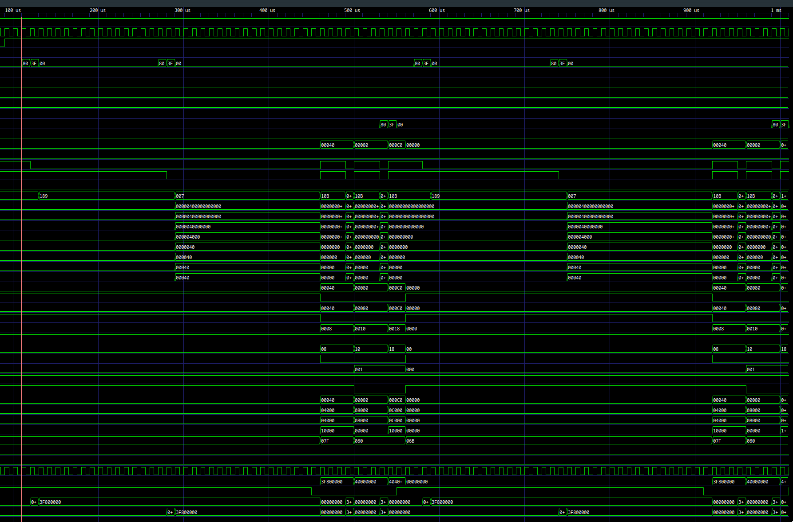

## How it works

`tt_um_lledoux_s3fdp_seqcomb` wraps a generated seq+comb arithmetic core built from MLIR with Emeraude + CIRCT.

The flow detects a loop pattern in MLIR (`scf.for` + `memref.load/store` + `arith.mulf/addf`) and emits a specialized S3FDP accumulator instead of generic floating-point datapath logic.

Canonical loop shape:

```mlir
scf.for %k = %c0 to %c2 step %c1 {
  %x = memref.load %a[%k] : memref<2xf32>
  %y = memref.load %b[%k] : memref<2xf32>
  %acc = memref.load %c[%c0] : memref<2xf32>
  %m = arith.mulf %x, %y : f32
  %s = arith.addf %acc, %m : f32
  memref.store %s, %c[%c0] : memref<2xf32>
}
```

## Arithmetic model (S3FDP)

S3FDP is used as a truncated Kulisch-like fixed-point accumulation strategy:

- multiply input terms,
- accumulate in a constrained fixed-point-like internal format,
- convert back to `f32`.

Specialization used in this project:

- `ovf=2`
- `msb=4`
- `lsb=-6`
- `chunk_size=16`

## Llama / PyTorch source example

The source pattern used in experiments:

```python
class LlamaFfnSublayer(nn.Module):
    """Llama FFN sublayer using SwiGLU (SiLU-gated linear unit)."""

    def __init__(self, dim: int = 512, hidden_dim: int | None = None, multiple_of: int = 256):
        super().__init__()
        if hidden_dim is None:
            hidden_dim = 4 * dim
            hidden_dim = int(2 * hidden_dim / 3)
            hidden_dim = multiple_of * ((hidden_dim + multiple_of - 1) // multiple_of)
        self.w_gate = nn.Linear(dim, hidden_dim, bias=False)
        self.w_up = nn.Linear(dim, hidden_dim, bias=False)
        self.w_down = nn.Linear(hidden_dim, dim, bias=False)

    def forward(self, x: torch.Tensor) -> torch.Tensor:
        gate = F.silu(self.w_gate(x))
        up = self.w_up(x)
        return self.w_down(gate * up)
```

High-level linalg excerpt:

```mlir
...
%8 = linalg.generic
  {ins(%7: tensor<1x2x16xf32>) outs(%5: tensor<1x2x16xf32>) {
    %19 = arith.negf %in : f32
    %20 = math.exp %19 : f32
    %21 = arith.addf %20, %cst_1 : f32
    %22 = arith.divf %cst_1, %21 : f32
    linalg.yield %22 : f32
  }} -> tensor<1x2x16xf32>

%9 = linalg.generic
  {ins(%8, %7: tensor<1x2x16xf32>, tensor<1x2x16xf32>)
   outs(%5: tensor<1x2x16xf32>)} {
    %19 = arith.mulf %in, %in_7 : f32
    linalg.yield %19 : f32
  } -> tensor<1x2x16xf32>
...
```

## Internal IR snapshots

Comb-specialized stage (`generated/ir-stages/20-flopoco-comb.mlir`):

```mlir
%s3fdp_accum.r = hw.instance "s3fdp_accum" @s3fdp_accum_core_wE8_wF23_cs16(
  clk: %3: !seq.clock, reset: %arg1: i1, x: %1: i32, y: %2: i32
) -> (r: i32)
```

Seq/HW aggregate stage (`generated/ir-stages/60-hw-aggregate.mlir`):

```mlir
%27 = seq.clock_gate %26, %3
%s3fdp_accum.r = hw.instance "s3fdp_accum" @s3fdp_accum_core_wE8_wF23_cs16(
  clk: %27: !seq.clock, reset: %reset: i1, x: %18: i32, y: %25: i32
) -> (r: i32)
seq.write %c_mem[%false] %s3fdp_accum.r wren %3 {latency = 1 : i64} : !seq.hlmem<2xi32>
```

SV-lowered stage (`generated/ir-stages/90-hw-to-sv.mlir`):

```mlir
%c_mem = sv.reg : !hw.inout<uarray<2xi32>>
sv.alwaysff(posedge %clk_0) {
  sv.if %4 {
    %33 = sv.array_index_inout %c_mem[%false] : !hw.inout<uarray<2xi32>>, i1
    sv.passign %33, %s3fdp_accum.r : i32
  }
}
```

## Interface protocol

Input stream on `ui_in[7:0]`:

- 20-byte frame, little-endian
- `a[0..1]` IEEE754 `f32` (8 bytes)
- `b[0..1]` IEEE754 `f32` (8 bytes)
- `c0` IEEE754 `f32` seed (4 bytes)

Execution:

- hold core reset during load,
- release reset after byte 20,
- wait 3 cycles,
- output one 32-bit result on `uo_out[7:0]` as 4 little-endian bytes.

Frame slot: 27 cycles (`20 load + 3 run + 4 output`).

`uio` pins are unused.

## Generation and test

Generate core + IR stages:

```sh
./scripts/generate_s3fdp_core.sh
```

Run simulation:

```sh
cd test
make clean
make -B
```

Waveform screenshot:



## External hardware

No external hardware is required.
